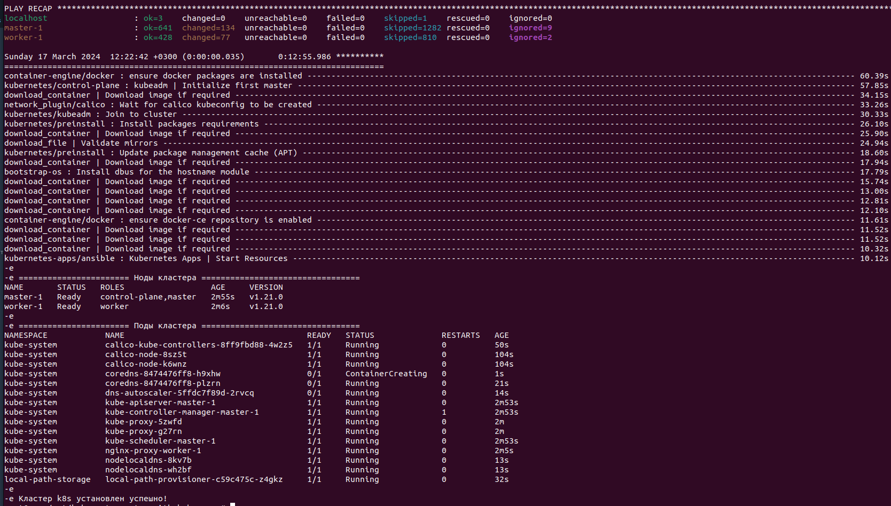

# sf-diploma-sprint1

## Задача

Опишите инфраструктуру будущего проекта в виде кода с инструкциями по развертке, нужен кластер Kubernetes и служебный сервер (будем называть его srv).

1. Выбираем облачный провайдер и инфраструктуру.
2. Описываем инфраструктуру.
3. Автоматизируем установку.

**Нам нужно три сервера:**
- два сервера в одном кластере Kubernetes: 1 **master** и 1 **app**;
- сервер **srv** для инструментов мониторинга, логгирования и сборок контейнеров.

Описывать инфраструктуру мы будем, конечно, в Terraform.

Пишем в README.md инструкцию по развертке конфигураций в облаке. Никаких секретов в коде быть не должно.

Надо реализовать возможность установки на сервер всех необходимых нам настроек и пакетов, будь то docker-compose, gitlab-runner или наши публичные ключи для доступа по SSH. Положите код автоматизации в Git-репозиторий.

## Создание сервера srv (примерно 10 мин.)
1. Вы должны производить действия на локальном хосте с Unix-системой (у меня Ubuntu 2204); должен быть установлен terraform; должны быть сгенерированы ssh-ключи без пароля с именами `id_rsa`и `id_rsa.pub` в директории `~/.ssh/`
2. Скачать репо и перейти в директорию `git clone https://github.com/andryplekhanov/sf-diploma-sprint1.git && cd sf-diploma-sprint1 && cd terraform`
3. Инициировать терраформ `terraform init`
4. Применить `terraform apply -var="yandex_cloud_token=<ваш токен>" -var="cloud_id=<ваш cloud_id>" -var="folder_id=<ваш folder_id>"`
5. В результате получаем в консоли ip-адрес сервера:
```
external_ip_address_srv = [
  [
    "158.160.45.224",
  ],
]
```

## Создание кластера k8s (примерно 15 мин.)
1. Подключиться по ssh к серверу srv `ssh ubuntu@<external_ip_address_srv>`
2. Сделаться суперюзером `sudo su`
3. Перейти в директорию `cd /opt/kubernetes_setup_with_kubespray`
4. Запустить скрипт `sh cluster_install.sh`
5. В результате получаем в консоли информацию о кластере


## Удаление
Если ничего больше не нужно, то удаляем всё в 2 этапа:
1. На сервере **srv**: `sudo su`, `cd /opt/kubernetes_setup_with_kubespray`, `sh cluster_destroy.sh`
2. На локальном хосте в каталоге `sf-diploma-sprint1/terraform`: `terraform destroy -var="yandex_cloud_token=<ваш токен>" -var="cloud_id=<ваш cloud_id>" -var="folder_id=<ваш folder_id>"`